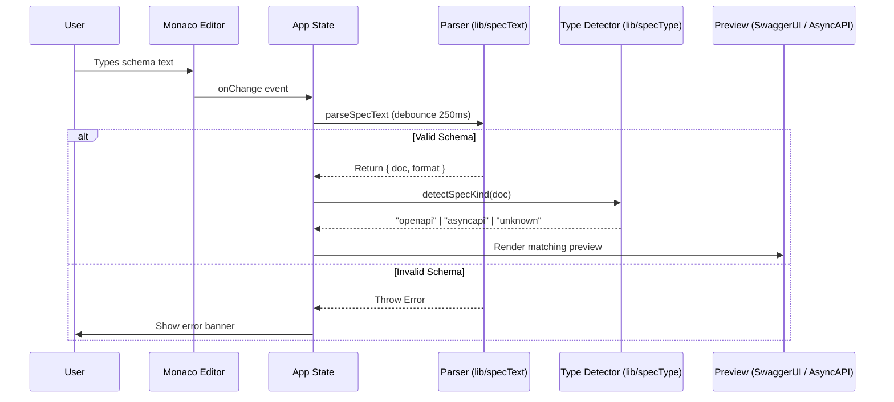
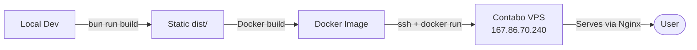

# Architecture Documentation

This document provides a detailed overview of the Janus project's architecture, third-party integrations, and deployment strategy.

## 1. System Overview

Janus is a Progressive Web Application (PWA) designed for viewing and editing OpenAPI and AsyncAPI specifications. It features a split-view interface with a high-performance code editor (Monaco) and live previews (Swagger UI for OpenAPI, custom renderer for AsyncAPI 2.x and 3.x).

## 2. System Architecture

The following C4 Container diagram illustrates the high-level structure of the Janus application and its external dependencies.

```mermaid
graph TD
    User([User])
    
    subgraph "Janus Application (Client-Side)"
        App[React App]
        Editor[Monaco Editor]
        Preview[Swagger UI / AsyncAPI Preview]
        Storage[(Local Storage / Session Storage)]
        Logger[Logger Client]
    end
    
    subgraph "External Services"
        Hosting[Contabo VPS 167.86.70.240]
        LoggerAPI[Logger API (Disabled)]
    end
    
    User -->|Interacts with| App
    App -->|Manages state| Editor
    App -->|Renders spec| Preview
    App -->|Persists locally| Storage
    App -->|Sends logs| Logger
    Logger -.->|Ingested (disabled)| LoggerAPI
    Hosting -->|Serves static files| App
```

## 3. Component Interaction

This sequence diagram shows how the application handles spec changes, parsing, and rendering.



## 4. Deployment Pipeline

Janus is deployed as a Dockerized Nginx application on the Contabo VPS (`167.86.70.240`). Deployments are triggered manually via the deploy script.



## 5. 3rd Party Services & APIs

| Service | Purpose | Integration Details |
|---------|---------|---------------------|
| **Contabo VPS** | Hosting | Static site served via Nginx Docker container at `167.86.70.240`. |
| **Monaco Editor** | Code editing | Integrated via `@monaco-editor/react`. Lazy-loaded for initial bundle size. |
| **Swagger UI** | OpenAPI rendering | `swagger-ui-react` renders OpenAPI 2.0/3.x specs. Submit methods disabled. |
| **pako** | URL compression | `deflate` / `inflate` used to compress specs into base64url URL hashes. |
| **yaml** | YAML parsing & serialization | `yaml` package handles YAML ↔ object conversion. |
| **Logger API** | Observability | Disabled. `logEvent()` is a no-op. Infrastructure (`buildLogPayload`, `sendLog`, retry logic) is retained but not called. |

## 6. Data Flow & State Management

- **Local State:** React `useState` and `useMemo` handle the active schema text, parsed document, parse errors, and UI state (theme, font size, menu).
- **Persistence:**
    - `localStorage` (`openapi:last-schema`): stores the last saved schema.
    - `localStorage` (`openapi:theme`): stores the user's theme preference (`light`, `dark`, or `system`).
    - `sessionStorage` (`logger:session-id`): stores an ephemeral session UUID for log correlation.
    - `URL Hash` (`#schema=v1.deflate.<payload>`): stores a pako-deflated + base64url-encoded version of the schema for sharing.
- **Schema loading priority:** URL hash → `localStorage` → sample spec fallback.

## 7. AsyncAPI Preview

The custom `AsyncApiPreview` component supports both AsyncAPI 2.x and 3.x document structures:

| Feature | AsyncAPI 2.x | AsyncAPI 3.x |
|---------|-------------|-------------|
| Channels | `channels[name].publish / .subscribe` | `channels[name].messages` |
| Operations | Inline on channels | Top-level `operations` map |
| Components | `components.messages`, `components.schemas` | same |

Unknown fields in either version are rendered as collapsible JSON blocks.

## 8. Security Details

- **Input Sanitization:** Specs are parsed using standard `JSON.parse` and `yaml.parse`. No `eval` or dynamic code execution.
- **HTTPS:** Enforced at the edge via reverse proxy on the Contabo VPS.
- **Logging Safety:** `sanitizeContext` strips non-primitive values before any log payload is built, preventing accidental leakage of nested objects or arrays.
- **Share Links:** URL hash payloads are decompressed client-side only; no server ever receives or stores spec content.
