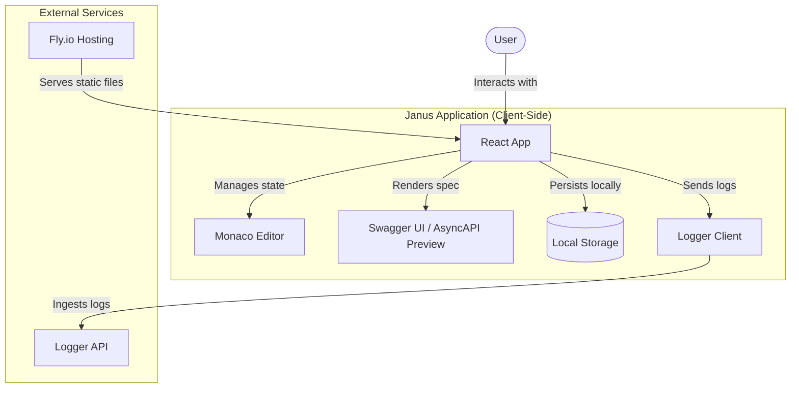
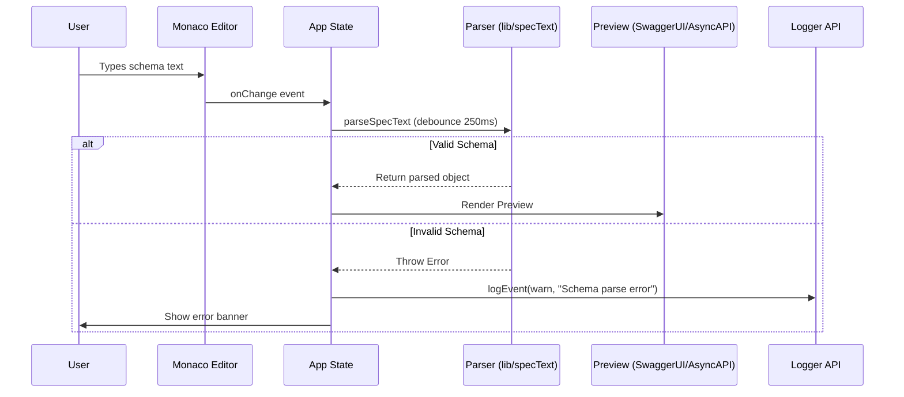
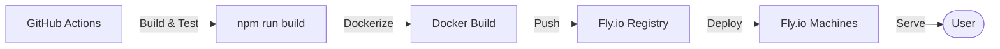

# Architecture Documentation

This document provides a detailed overview of the Janus project's architecture, third-party integrations, and deployment strategy.

## 1. System Overview

Janus is a Progressive Web Application (PWA) designed for viewing and editing OpenAPI and AsyncAPI specifications. It features a split-view interface with a high-performance code editor (Monaco) and live previews (Swagger UI for OpenAPI, custom renderer for AsyncAPI).

## 2. System Architecture

The following C4 Container diagram illustrates the high-level structure of the Janus application and its external dependencies.

## 3. Component Interaction

This sequence diagram shows how the application handles spec changes, parsing, and rendering.

## 4. Deployment Pipeline

Janus is deployed using a Dockerized Nginx setup on Fly.io.

## 5. 3rd Party Services & APIs

| Service | Purpose | Integration Details |
|---------|---------|---------------------|
| **Fly.io** | Hosting | Static site hosting via Docker/Nginx. |
| **Logger API** | Observability | Remote log ingestion for errors and analytics. |
| **Monaco Editor** | Code Editing | Integrated via `@monaco-editor/react`. |
| **Swagger UI** | OpenAPI Rendering | Used to render OpenAPI 2.0/3.0/3.1 specs. |
| **Vitest** | Testing | Unit and integration testing framework. |

## 6. Data Flow & State Management

- **Local State:** React `useState` and `useMemo` handle the active schema and parsed documents.
- **Persistence:** 
    - `localStorage`: Stores the last edited schema.
    - `URL Hash`: Stores a compressed (pako/base64) version of the schema for sharing.
- **Logging:** All major events (app load, schema save, parse errors) are asynchronously sent to the Logger API.

## 7. Security Details

- **Input Sanitization:** Specs are parsed using standard JSON/YAML parsers.
- **HTTPS:** Enforced by Fly.io at the edge.
- **Logging Safety:** Contextual data is sanitized before being sent to the Logger API to prevent leaking sensitive information.
